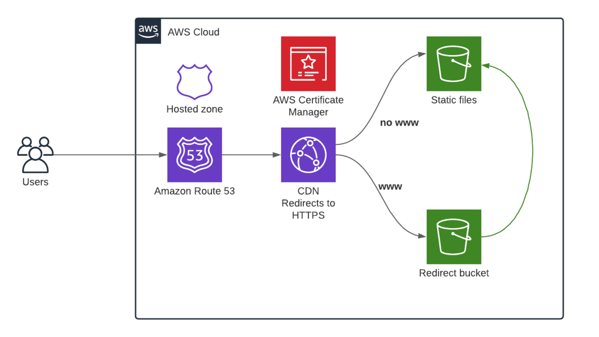
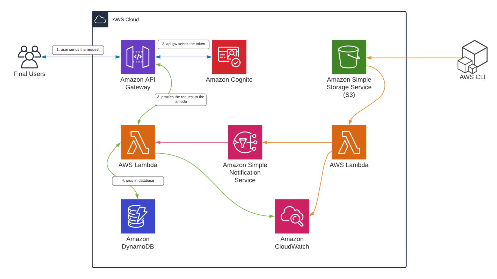
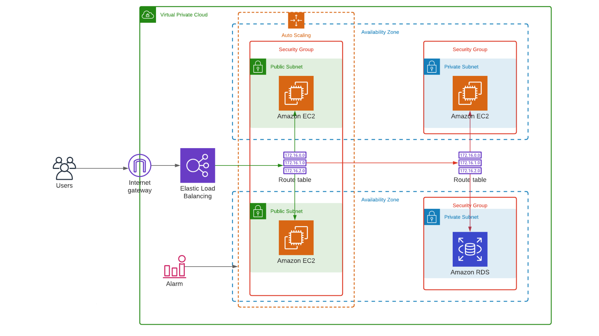

# AWS Terraform

### Commands

- terraform init
- terraform plan
- terraform validate
- terraform apply -auto-approve
- terraform destroy

## Static Website

    

## Serverless Application

    

## Autoscaling Application

    

